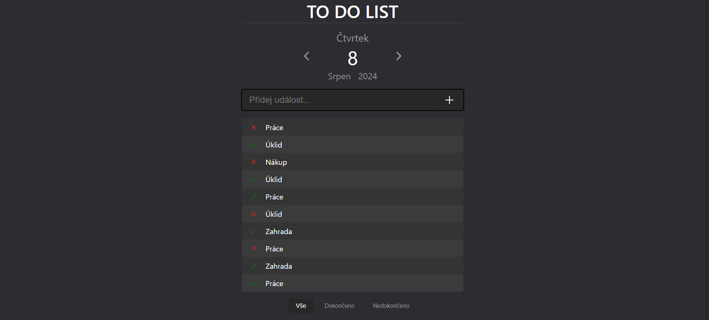
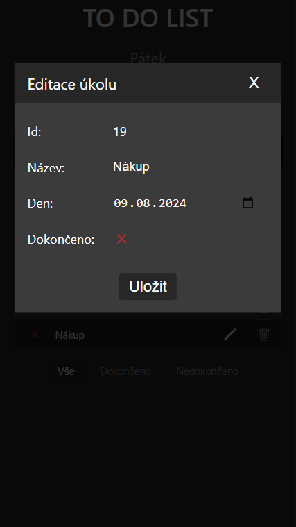

# ToDo App

Just small toDo application.




## Descritption

Application has just one main panel with date indicator, task table and filter buttons.  

User can change date to view his tasks on this day.  

Initial tasks are just some array and dates are yesterday,today and tomorrow. Tasks are simple objects with 4 parameters: id, name, date, status. User can change any of these paramteres expect id. There is modal window for task editing.  

It is possible to filter tasks, done, running, all.  

For adding new event on certain date user just enter task name into input and click button.  



## Installation 
1. Clone gitHub repository ```git clone https://github.com/ZbrMa/toDo-app.git ```
2. Navigate to app folder ```cd todo-app```
3. Install dependencies ```npm install```
4. Run ```npm start```


